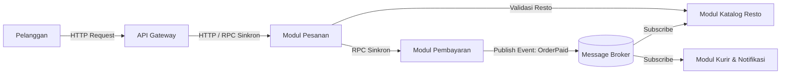

# Tugas 2 — Perancangan Arsitektur

**Kelompok:** [PaperRex]

| Nama | NIM | Kontribusi |
|---|---|---|
| [Rizqullah Izzul Ibad Gheaz] | [103072400033] | [Soal 3 & 4] |
| [Habhindra Dzaky Alghifary] | [103072400095] | [Soal 2] |
| [Muhammad Zaki Oktaruna] | [103072400001] | [Soal 1] |

## Soal 1 Pemilihan Gaya Arsitektur & Justifikasi — ditulis oleh [Muhammad Zaki Oktaruna]

Gaya arsitektur yang dipilih adalah Kombinasi antara Service-Oriented Architecture (SOA) dan Publish-Subscribe (Pub-Sub)

SOA (Service-Oriented Architecture): Digunakan untuk interaksi inti yang bersifat transaksional dan membutuhkan kepastian langsung (synchronous request-response), contohnya komunikasi antara Modul Pesanan dan Modul Pembayaran. Pembayaran harus divalidasi saat itu juga agar status pesanan jelas

Publish-Subscribe (Pub-Sub): Digunakan melalui Message Broker untuk proses penyiaran notifikasi yang tidak harus memblokir proses utama, seperti memberi tahu Modul Katalog Resto dan Modul Kurir/Notifikasi setelah pesanan berhasil dibayar

Kombinasi ini dipilih karena memberikan keseimbangan antara keandalan data transaksi (lewat SOA) dan performa yang longgar serta cepat tanpa ketergantungan langsung antar-modul (lewat Pub-Sub). Jika modul kurir mengalami kendala, modul pembayaran dan pesanan tidak akan ikut down

---

## Soal 2 KOmponen dan Interaksi — ditulis oleh [Habhindra Dzaky Alghifary]

**Modul Gateway:** sebagai single entry untuk menerima permintaan user,melakukan verfikasi awal dan meneruskan permintaan user ke service tanpa user ketahui

**Modul Pesanan:** sebagai mencatat data pesanan user, pembuatan pesanan baru,merubah status pesanan

**Modul Pembayaran:** modul pembayaran ini terhubung atau terkordinasi dengan aplikasi payment pihak ke tiga.setelah bayar dan terverifikasi maka modul ini menjadi pemicu ke proses berikutnya

**Modul Katalog:** modul ini menyediakan data menu untuk user dan berfungsi menerima event lewat massage broker ketika ada pesanan yang sudah di bayar

**Modul Kurir/Notifikasi:** modul ini betugas untuk mencari dan menugaskan kurir terdekat untuk mengambil pesanan ke restoran dan mengirimkan notifikasi secara real time ke perangkat kurir dan user

**Massage Broker:** analoginya ini bertindak sebagai papan pengunguman digital di dalam sistem.Dengan adanya Message Broker, Modul Pembayaran cukup mengtriger satu kali ke sistem (publish event), lalu modul resto dan kurir yang mendengarkan (subscribe) akan mengambil pesannya sendiri secara mandiri tanpa membuat sistem mengalami blocking atau downtime

---

## Soal 3 Skenario End-to-End & Jenis Komunikasi — ditulis oleh [Rizqullah Izzul Ibad Gheaz]

### Alur Skenario End-to-End:
1. **Pelanggan $\rightarrow$ API Gateway (Sinkron | Request-Response via HTTP/HTTPS):**  
   Pelanggan menekan tombol "Bayar/Pesan" di aplikasi. Permintaan diterima oleh **API Gateway** sebagai pintu masuk tunggal.
2. **API Gateway $\rightarrow$ Modul Pesanan (Sinkron | Request-Response via HTTP/gRPC):**  
   API Gateway melanjutkan permintaan ke **Modul Pesanan** untuk mencatat draf pesanan baru dan menghitung total tagihan.
3. **Modul Pesanan $\rightarrow$ Modul Katalog Resto (Sinkron | Request-Response via RPC/REST):**  
   Modul Pesanan melakukan query singkat ke **Modul Katalog Resto** untuk memverifikasi ketersediaan stok menu yang dipesan.
4. **Modul Pesanan $\rightarrow$ Modul Pembayaran (Sinkron | Request-Response via RPC/gRPC):**  
   Modul Pesanan memanggil **Modul Pembayaran** secara *blocking* untuk memproses transaksi dengan *payment gateway* pihak ketiga.
5. **Modul Pembayaran $\rightarrow$ Message Broker (Asinkron | Event-Driven / Publish):**  
   Setelah pembayaran berhasil diverifikasi, Modul Pembayaran menerbitkan *event* bernama `OrderPaid` ke **Message Broker**. Modul Pembayaran tidak perlu menunggu modul lain merespons (*non-blocking*).
6. **Message Broker $\rightarrow$ Modul Katalog Resto (Asinkron | Event-Driven / Subscribe):**  
   **Modul Katalog Resto** yang bertindak sebagai *subscriber* menerima pesan `OrderPaid` dari Message Broker, lalu otomatis memperbarui status pesanan di dasbor restoran agar dapur mulai memasak.
7. **Message Broker $\rightarrow$ Modul Kurir & Notifikasi (Asinkron | Event-Driven / Subscribe):**  
   Secara bersamaan (*paralel*), **Modul Kurir & Notifikasi** menerima pesan `OrderPaid` dari Message Broker untuk segera mencari/menugaskan kurir terdekat dan mengirimkan notifikasi *real-time* ke HP kurir serta pelanggan.

---

## Soal 4 Analisis Decoupling & Trade-off — ditulis oleh [Rizqullah Izzul Ibad Gheaz]

### 1. Mengapa Arsitektur Ini Mengatasi Masalah Coupling dari Tugas 1?
Pada Tugas 1, FoodGo menggunakan arsitektur monolitik di mana semua modul berjalan dalam satu proses tunggal dan saling memanggil secara *blocking synchronous*. Hal ini menyebabkan *tight coupling*: jika satu modul lambat/bermasalah, seluruh sistem akan ikut *crash*.

Kombinasi SOA dan Pub-Sub mengatasi masalah tersebut melalui dua aspek:
* **Penghilangan *Temporal Coupling* (Mekanisme Asinkron):** Modul Pembayaran tidak perlu menunggu Modul Kurir selesai mencari driver untuk menyelesaikan proses pemesanan. Cukup dengan menembak *event* ke Message Broker, pemrosesan transaksi pengguna selesai seketika.
* **Isolasi Kegagalan & Independensi Pendeployan (*Decoupled Deployment*):** Apabila Modul Kurir atau Modul Katalog Resto mengalami gangguan (*down*) atau sedang di-*deploy* ulang oleh tim pengembang, proses transaksi utama (Pesan & Bayar) tetap berjalan lancar. Pesan notifikasi akan tersimpan aman di antrean Message Broker dan baru diproses ketika modul bersangkutan aktif kembali.

### 2. Trade-off (Risiko & Kompleksitas Baru)
Meskipun meningkatkan skalabilitas dan ketahanan sistem, arsitektur ini membawa beberapa *trade-off* baru:
* **Kompleksitas *Debugging* & Pelacakan Alur (*Non-Linear Flow*):** Karena komunikasi antar-modul beralih dari garis lurus (*linear*) menjadi berbasis *event*, melacak letak kesalahan (*bug*) saat pesan hilang atau gagal diproses menjadi sangat sulit. Diperlukan perkakas tambahan seperti *Distributed Tracing* (misalnya Jaeger/Zipkin).
* **Konsistensi Data Bertahap (*Eventual Consistency*):** Data tidak lagi konsisten secara instan di seluruh sistem secara bersamaan. Terdapat jeda waktu (*latency*) beberapa milidetik hingga detik dari saat pembayaran sukses sampai kurir mendapatkan pesanan.
* **Overhead Operasional & Infrastruktur:** Menambahkan komponen *API Gateway* dan *Message Broker* (seperti RabbitMQ/Kafka) meningkatkan biaya infrastruktur dan beban tim DevOps untuk memelihara serta memantau kesehatan *broker* tersebut.

## Kesimpulan Kelompok

Dengan mentransformasi sistem monolitik FoodGo menjadi kombinasi arsitektur **Service-Oriented Architecture (SOA)** dan **Publish-Subscribe (Pub-Sub)**, masalah kegagalan sistem dan *tight coupling* yang dianalisis pada Tugas 1 dapat teratasi secara efektif:

1. **Pemisahan Tanggung Jawab & Ketahanan Sistem:** Alur transaksi inti (Pesan & Bayar) yang bersifat kritis tetap menggunakan komunikasi sinkron via SOA/API Gateway untuk memastikan kepastian pembayaran. Sementara itu, proses sekunder (notifikasi resto & penugasan kurir) dialihkan menjadi asinkron berbasis *event* via Message Broker.
2. **Independensi Tim & Pendeployan:** Tim Kurir dan Tim Resto kini dapat melakukan pembaruan, pemeliharaan, atau *scaling* pada layanannya masing-masing tanpa takut mengganggu ketersediaan (*availability*) modul utama maupun menyebabkan *downtime* total.
3. **Kompromi Arsitektural (*Trade-off*):** Keberhasilan penerapan arsitektur ini menuntut tim FoodGo untuk siap mengelola kompleksitas baru, khususnya dalam hal *debugging* aliran data terdistribusi, pengelolaan infrastruktur Message Broker, serta penerapan *distributed tracing* untuk menjaga keterandalan sistem secara menyeluruh.
