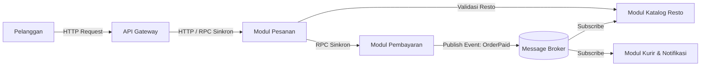

```mermaid
graph LR
    Client[Pelanggan] -->|HTTP Request| Gateway[API Gateway]
    Gateway -->|HTTP / RPC Sinkron| OrderSvc[Modul Pesanan]
    OrderSvc -->|RPC Sinkron| PaymentSvc[Modul Pembayaran]
    OrderSvc -->|Validasi Resto| RestoSvc[Modul Katalog Resto]
    PaymentSvc -->|Publish Event: OrderPaid| Broker[(Message Broker)]
    Broker -->|Subscribe| RestoSvc
    Broker -->|Subscribe| CourierSvc[Modul Kurir & Notifikasi]
```